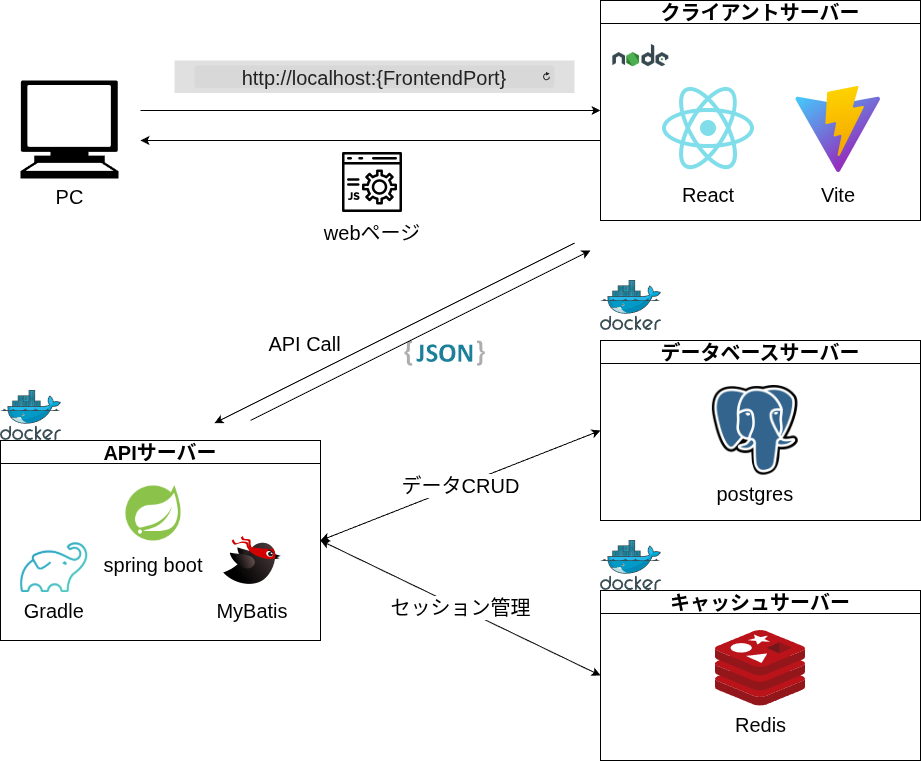

# SandboxDesigner

---

## プロジェクト概要

---

メモをカスタマイズして自分好みのメモスタイルを模索するためのアプリケーションです。

## 仕様書

---

<!-- TODO -->

仕様書は随時更新していく予定です。`docs/specification`フォルダ内に格納します。

- docs/specification/markdown/: 開発に合わせてすぐに書き換えるオリジナルの仕様書(Markdown形式)
- docs/specification/converted/: オリジナルを元にフォーマットを調整した仕様書(xlsx, pdf, docx形式)

## 環境構築ドキュメント

---

- docs/setup/github/git_setup.md : GitHubリポジトリの作成とSSH接続設定方法

## 開発環境概要

---

- フロントエンド: React, TypeScript, Vite
- バックエンド: Java, Spring Boot
- データベース: PostgreSQL
